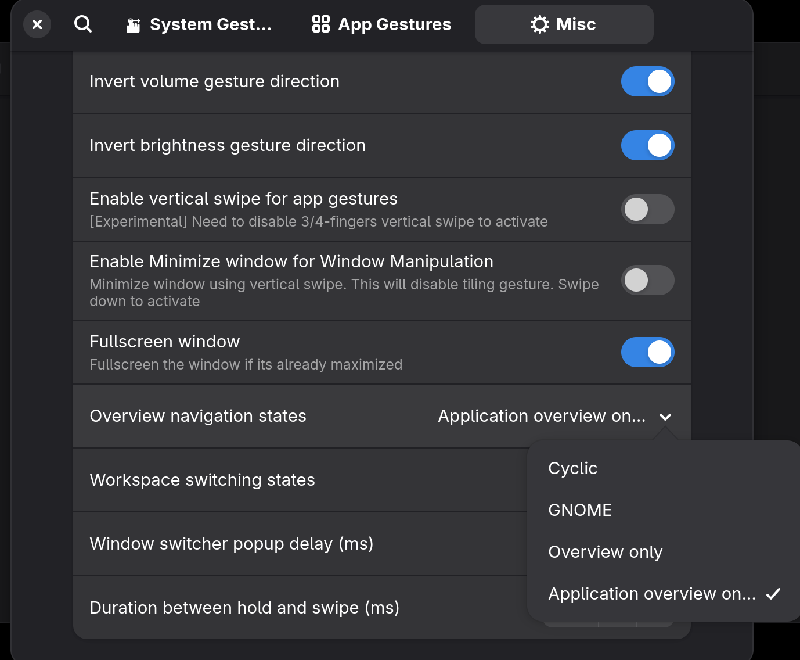
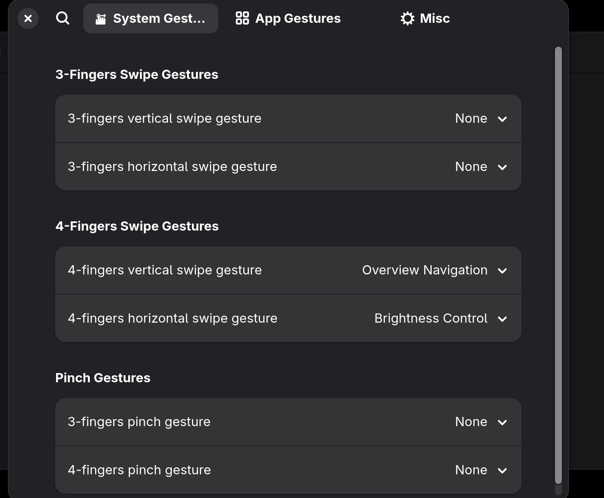

# Touchpad Gesture Customization #

This extension modifies and extends existing touchpad gestures on GNOME using Wayland. This project is a fork of [gnome-gesture-improvements](https://github.com/harshadgavali/gnome-gesture-improvements). Since the original project seems to be no longer maintained, I setup this project with the aim of taking over the development and maintenance of this wonderful extension that I relied on for daily use.

### About this fork

This repository ([7mind/touchpad-gesture-customization-app-expose](https://github.com/7mind/touchpad-gesture-customization-app-expose)) is a downstream fork of [HieuTNg/touchpad-gesture-customization](https://github.com/HieuTNg/touchpad-gesture-customization). It exists primarily to add a macOS-style **App Exposé** behavior to the overview gesture: when configured, swiping down with 3/4 fingers spreads only the windows of the currently focused application, while swiping up keeps the standard GNOME overview / app grid navigation. See the *Application overview on down* mode under *Overview navigation states* in the extension preferences. Changes from this fork may or may not be upstreamed.

In `gnome-extensions-app` settings,

`Overview navigation states` should be set to `Application overview on down`:



At least one vertical swipe gesture should be set to `Application overview`:



Then swipe up will show default overview and swipe down will show an overview of current application's windows only.

**Note**:
- ```main``` branch contains latest changes which may not work on older version of GNOME, please choose the correct branch if install from source.
- To view the extension's settings window, user need to install ```extensions``` app.
- I have removed the support for X11 since I only use Wayland, but this can be added again in the future if needed and if someone is willing to support this.
- There is a bug in GNOME 49 which break the extension, you have to upgrade to GNOME 49.3 or compile it from source for the extension to work again.

## Installation

### Manually

1. Install extension

```
git clone https://github.com/7mind/touchpad-gesture-customization-app-expose.git
cd touchpad-gesture-customization-app-expose
npm install
npm run update
```

2. Log out and log in
3. Enable extension via extensions app or via command line

```
gnome-extensions enable touchpad-gesture-customization@coooolapps.com
```

If you're updating the extension, make sure the old version is fully uninstalled. Run:

```
gnome-extensions uninstall touchpad-gesture-customization@coooolapps.com
```

And log out and log in again.

## Gestures

| Swipe Gesture                           | Modes    | Fingers  | Direction           |
| :-------------------------------------- | :------- | :------- | :------------------ |
| Show current application windows (\*\*) | Desktop  | 3/4/both | Vertical down       |
| Desktop/Overview/AppGrid navigation     | Any      | 3/4/both | Vertical/Horizontal |
| Switch workspaces                       | Overview | 2/3/4    | Horizontal          |
| Switch workspaces                       | Any      | 3/4/both | Vertical/Horizontal |
| Switch app pages                        | AppGrid  | 2/3      | Horizontal          |
| Switch windows                          | Desktop  | 3/4/both | Vertical/Horizontal |
| Unmaximize/maximize/fullscreen a window | Desktop  | 3/4/both | Vertical            |
| Minimize a window                       | Desktop  | 3/4/both | Vertical            |
| Snap/half-tile a window                 | Desktop  | 3/4/both | Vertical (\*)       |
| Volume Control                          | Desktop  | 3/4/both | Vertical/Horizontal |
| Brightness Control                      | Desktop  | 3/4/both | Vertical/Horizontal |

| Pinch Gesture Actions  | Description                                    | Fingers |
| :--------------------- | :--------------------------------------------- | :------ |
| Show Desktop (\*)      | Hide all application (i.e. windows), pinch out | 3/4     |
| Close Window           | Close an application, like clicking on "x"     | 3/4     |
| Close Tab/Document     | Close a tab in application that uses tabs      | 3/4     |
| Show Notification List | Show GNOME notification                        | 3/4     |

| Application Gestures Actions (\*) | Description                                      |
| :-------------------------------- | :----------------------------------------------- |
| Forward/Backward                  | Go back or forward in browser tab                |
| Page up/down                      | Scroll up/down 1 page                            |
| Right/Left                        | Switch to next or previous image in image viewer |
| Audio Next/Prev                   | Switch to next or previous audio                 |
| Tab Next/Prev                     | Change tabs (e.g. in browser or file manager)    |

#### For activating snapping/tiling gesture (inverted T gesture)

1. Do a 3/4-fingers vertical swipe downward gesture on an unmaximized window but don't release the gesture
2. Wait a few milliseconds
3. Do a 3/4-fingers horizontal swipe gesture to tile a window to either side of the screen

#### For activating application gesture

1. Activate a 3/4-fingers hold gesture on touchpad by pressing your fingers on touchpad but don't release the gesture
2. Wait a few milliseconds
3. Do a 3/4-fingers vertical/horizontal swipe gesture to activate the application gesture (an arrow animation circle will appear)

#### Application Gesture Notes

- For horizontal gestures, application gesture only works if 3/4-fingers horizontal swipe is set to **Window Switching**
- Application gesture also supports vertical swipe but is still experimental and requires users to turn off other actions for 3/4-fingers vertical swipe (i.e. set the action to None).

#### Notes

- Enabling minimizing window gesture for Window Manipulation will disable snapping/tiling gesture.
- If you are using an older version of GNOME, there might be a bug which prevent the extension from detecting **hold and swipe gesture** and **pinch gesture**. If you face this problem, the gesture can only work if the mouse pointer is pointed at the desktop or top panel.
- (\*\*) **App Exposé / current application windows** is exposed as a sub-mode of the existing Overview gesture rather than a standalone gesture. Set *Overview navigation states* to *Application overview on down* in the extension preferences (see *Customization* below). With this mode active, swiping up still opens the regular overview / app grid; swiping down past a small threshold filters the overview to windows of the currently focused application (similar to macOS App Exposé). Reversing direction within the same swipe restores the regular overview. The mode falls back to the standard overview when no app is focused or when no app windows are eligible for spreading.

## Customization

- To switch to windows from _all_ workspaces using 3-fingers swipes, run

```
gsettings set org.gnome.shell.window-switcher current-workspace-only false
```

# Acknowledgement

Massive thanks to the original author and everyone who has contributed to the original project to bring us this wonderful GNOME extension.

[gnome-gesture-improvements](https://github.com/harshadgavali/gnome-gesture-improvements) - Original GNOME Gesture Improvement

[Screen Brightness Governor](https://github.com/inbalboa/gnome-brightness-governor) - brightness control code.

[Volume Scroller](https://github.com/francislavoie/gnome-shell-volume-scroller) - volume control code.
